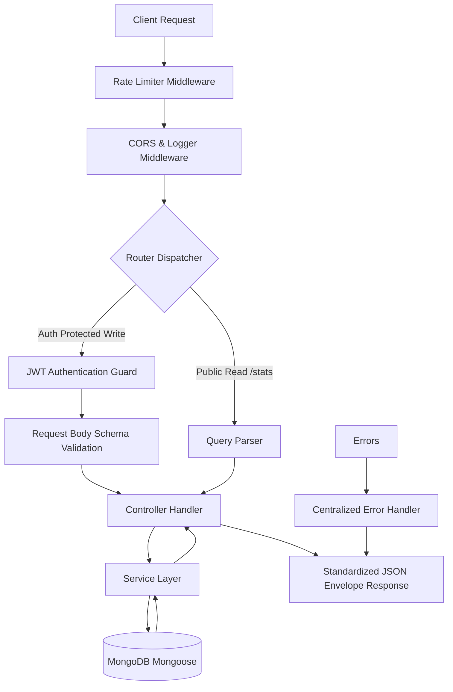
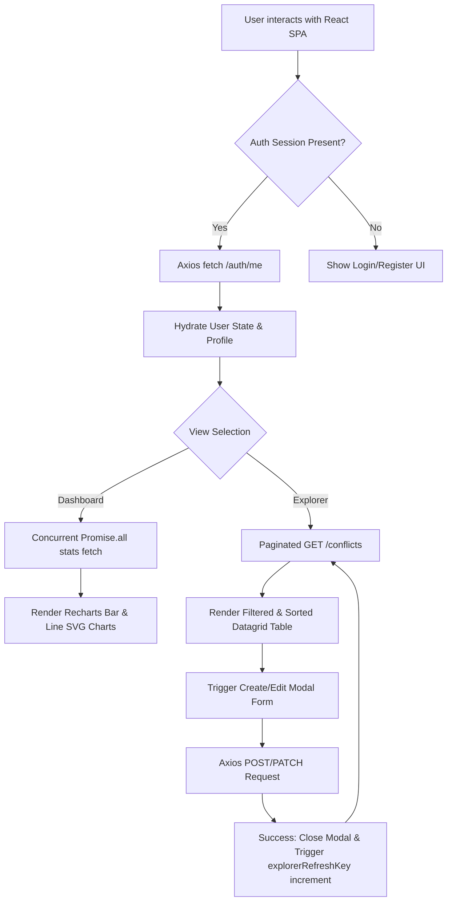

# ⚔️ War Economic Impact Analytics Portal

> A production-grade, full-stack research platform for analysing the macroeconomic consequences of global armed conflicts — war costs, inflation spikes, GDP contractions, unemployment shifts, poverty rates, and reconstruction expenditures — all presented through interactive data visualisations and a secure REST API.


---

## 📋 Table of Contents

1. [Overview](#-overview)
2. [Key Features](#-key-features)
3. [Tech Stack](#-tech-stack)
4. [Architecture & Project Structure](#️-architecture--project-structure)
5. [Backend & Frontend Workflows](#-backend--frontend-workflows)
   - [Backend Workflow](#backend-workflow)
   - [Frontend Workflow](#frontend-workflow)
6. [Getting Started](#-getting-started)
   - [Prerequisites](#prerequisites)
   - [Environment Variables](#environment-variables)
   - [Install Dependencies](#install-dependencies)
   - [Seed the Database](#seed-the-database)
7. [Running the Application](#-running-the-application)
   - [Development Mode](#development-mode)
   - [Production Mode](#production-mode)
8. [API Documentation](#-api-documentation)
   - [Authentication Endpoints](#authentication-endpoints)
   - [Conflict Registry CRUD](#conflict-registry-crud-endpoints)
   - [Analytics Aggregation](#analytics-aggregation-endpoints)
   - [Query Parameters](#query-parameters-get-conflicts)
9. [Data Model](#-data-model)
10. [Pull Request Workflow](#-pull-request-workflow)
11. [Contributing](#-contributing)
12. [License](#-license)

---

## 🌐 Overview

The **War Economic Impact Analytics Portal** is a research-focused full-stack web application that allows analysts, historians, and economists to:

- **Explore** a curated dataset of **42 global conflict records** spanning multiple regions and decades.
- **Visualise** macroeconomic indicators (war costs, inflation, GDP change) through interactive charts built with Recharts.
- **Manage** conflict data records via a secure CRUD interface with role-based access control.
- **Query** the dataset using a powerful REST API supporting filtering, sorting, pagination, and keyword search.

The backend exposes a **production-ready REST API** built with Node.js/Express/Mongoose. The frontend is a **dark-mode glassmorphic SPA** built with React 19 + Vite 8. In production, Express statically serves the compiled React bundle, making the entire application deployable as a single service.

---

## 🌟 Key Features

### 📊 Interactive Analytics Dashboard
- **Overview Metrics Cards**: Real-time totals for war cost (USD), average inflation rate, average GDP contraction index, and resolved/ongoing conflict counts.
- **Regional Cost Bar Chart**: Custom Recharts `BarChart` visualising direct military expenditures grouped by global region with gradient fills.
- **Inflation Line Chart**: Responsive Recharts `LineChart` plotting average vs. peak regional inflation indices per region.
- **Macroeconomic Spotlight Grid**: Highlight cards surfacing extreme case studies — highest inflation, worst GDP loss, peak reconstruction cost, and highest war expenditure.

### 🔍 Conflict Registry Explorer
- **Paginated Data Grid**: Dynamically fetches and displays conflict records with complete metadata columns.
- **Regex Keyword Search**: Real-time text search queried directly against the backend `queryParser`, matching conflict names, countries, and sector descriptors.
- **Multifaceted Filtering**: Client-side filter dropdowns for geographical region, conflict status (`Ongoing` / `Resolved`), and conflict type.
- **Whitelist-Validated Sorting**: Sort by `startYear`, `warCostUsd`, `inflationRate`, `gdpChange`, or `reconstructionCostUsd` in ascending or descending direction.
- **Full Pagination**: Page/Limit controls driven by backend metadata response (`totalCount`, `totalPages`, `currentPage`).

### ✏️ CRUD Data Management
- **Create Conflict Record**: Authenticated users can submit new conflict entries via a validated modal form.
- **Edit Conflict Record**: Full `PUT` replacement or `PATCH` partial update via an in-place popup form.
- **Delete Conflict Record**: Restricted to `admin` role users only. Sends a `DELETE` request followed by a grid refresh.

### 🔐 Security & Identity Management
- **Stateless JWT Authorization**: Passwords hashed with `bcryptjs` (salt rounds = 10). Session tokens signed with `HS256` and a configurable expiry (default `30d`).
- **Role-Based Access Control (RBAC)**: Public read access; authenticated write access; admin-only delete operations.
- **Payload Validation Layer**: Validation middleware (`validateBody`) inspects request shapes against predefined schemas before touching the database.
- **Custom Rate Limiting**: Memory-backed rate limiters — `15 requests/min` on auth routes, `60 requests/min` on general routes — to prevent brute-force and DoS attacks.
- **Request Logging**: Morgan-based HTTP request logger in `dev` format, extracting method, URL, status, and response time.

---

## 🛠️ Tech Stack

| Layer | Technology | Version | Purpose |
|---|---|---|---|
| **Runtime** | Node.js | `^18.x` | JavaScript server runtime |
| **Framework** | Express | `^5.x` | HTTP routing & middleware pipeline |
| **Database** | MongoDB | `^7.x` | NoSQL document store |
| **ODM** | Mongoose | `^8.x` | Schema modeling & query builder |
| **Authentication** | jsonwebtoken | `^9.x` | JWT signing & verification |
| **Password Hashing** | bcryptjs | `^2.x` | Salted password encryption |
| **Dev Reloader** | nodemon | `^3.x` | Auto-restart on file change |
| **UI Framework** | React | `^19.x` | Component-based SPA rendering |
| **Build Tool** | Vite | `^8.x` | Fast HMR dev server & bundler |
| **Charts** | Recharts | `^3.x` | SVG-based declarative charts |
| **HTTP Client** | Axios | `^1.x` | Promise-based API requests with interceptors |
| **Icons** | Lucide React | `^1.x` | Clean SVG icon library |
| **Styling** | Vanilla CSS | — | Custom glassmorphic dark-mode design system |

---

## 🏗️ Architecture & Project Structure

The repository is split into two independently-managed root directories. During development both run on separate ports with Vite proxying API requests. In production the Express server statically serves the compiled frontend bundle.

```
war_economic_impact_dataset_rishikesh_singh/
│
├── backend/                         # REST API Server (Node.js + Express + MongoDB)
│   ├── src/
│   │   ├── config/
│   │   │   └── db.js                # Mongoose connection bootstrap
│   │   ├── constants/
│   │   │   └── index.js             # HTTP status codes & RBAC role enums
│   │   ├── controllers/
│   │   │   ├── auth.controller.js   # Register, Login, Me, Logout handlers
│   │   │   ├── conflict.controller.js # CRUD + stats route handlers
│   │   │   ├── health.controller.js # Health probe endpoint
│   │   │   └── version.controller.js # Version info endpoint
│   │   ├── data/
│   │   │   └── war_economic_impact_dataset.json  # Raw source dataset (42 records)
│   │   ├── docs/
│   │   │   └── postman_collection.json  # Importable Postman collection
│   │   ├── middlewares/
│   │   │   ├── auth.middleware.js    # JWT protect + authorize(role) guards
│   │   │   ├── error.middleware.js   # Centralized error response handler
│   │   │   ├── logging.middleware.js # Morgan HTTP request logger
│   │   │   ├── rateLimit.middleware.js # Auth & general rate limiters
│   │   │   └── validation.middleware.js # validateBody(schema) wrapper
│   │   ├── models/
│   │   │   ├── conflict.model.js    # Conflict Mongoose schema + indexes
│   │   │   └── user.model.js        # User schema + bcrypt pre-save hook
│   │   ├── routes/
│   │   │   ├── index.js             # Central router mounting all sub-routers
│   │   │   ├── auth.routes.js       # /auth/* route definitions
│   │   │   ├── conflict.routes.js   # /conflicts/* route definitions
│   │   │   ├── health.routes.js     # /health route
│   │   │   └── version.routes.js    # /version route
│   │   ├── seed/
│   │   │   └── seedConflicts.js     # Database migration seeder script
│   │   ├── services/
│   │   │   ├── auth.service.js      # Registration, login & token business logic
│   │   │   └── conflict.service.js  # All Mongoose queries & aggregation pipelines
│   │   ├── utils/
│   │   │   ├── apiError.js          # Custom ApiError class (extends Error)
│   │   │   ├── apiResponse.js       # Standardized JSON response envelope
│   │   │   ├── asyncHandler.js      # try/catch wrapper for async route handlers
│   │   │   └── queryParser.js       # URL param → Mongoose query builder
│   │   ├── validators/
│   │   │   ├── auth.validator.js    # Auth payload validation schemas
│   │   │   └── conflict.validator.js # Conflict payload validation schemas
│   │   └── app.js                   # Express app: middleware stack + route mounting
│   ├── server.js                    # Entry point: env load → DB connect → listen
│   ├── .env.example                 # Environment variable template
│   └── package.json
│
├── frontend/                        # React SPA (Vite + Recharts + Axios)
│   ├── src/
│   │   ├── assets/                  # Static media assets
│   │   ├── components/
│   │   │   ├── Auth.jsx             # Login / Register tab form
│   │   │   ├── ConflictExplorer.jsx # Paginated grid with filters & search
│   │   │   ├── ConflictModal.jsx    # Create / Edit CRUD popup form
│   │   │   ├── Dashboard.jsx        # Analytics charts + overview cards
│   │   │   └── Navbar.jsx           # Navigation bar with health status badge
│   │   ├── context/
│   │   │   └── AuthContext.jsx      # Global auth state provider (React Context)
│   │   ├── utils/
│   │   │   └── api.js               # Axios instance with JWT request interceptor
│   │   ├── App.jsx                  # Root layout: routing + modal management
│   │   ├── index.css                # Dark glassmorphic CSS design system
│   │   └── main.jsx                 # React DOM mounting point
│   ├── index.html                   # HTML entry shell
│   ├── vite.config.js               # Vite config: React plugin + API proxy to :5050
│   └── package.json
│
├── .gitignore                       # Ignore node_modules, dist, .env files
└── README.md                        # This file
```

---

## 🔄 Backend & Frontend Workflows

The application coordinates data and visualizations across a clearly defined backend API lifecycle and frontend React state management framework.

### Backend Workflow

The Express backend manages the request lifecycle, auth guards, parameter parsing, data validations, service handlers, and centralized error logging.



1. **Global Request Pipeline**:
   - **Rate Limiting**: Every incoming HTTP request is intercepted by custom, in-memory rate limiting middleware (`rateLimit.middleware.js`) to block client IPs exceeding defined counts (15 req/min on auth, 30 req/min on search, 60 req/min on general routes).
   - **CORS & Morgan**: Access policies are configured via `cors`, and details are logged via the custom request logger middleware.
   - **Static Bundles**: Static directories are served for compiled frontend React code built inside `frontend/dist`.

2. **Routing & Guards**:
   - The central router `routes/index.js` splits namespaces: `/auth`, `/conflicts`, `/health`, and `/version`.
   - **JWT Authentication Guard (`protect`)**: For protected writing routes (e.g. `POST`, `PUT`, `PATCH`, `DELETE`), the request passes through the verification guard. It verifies the client's `Authorization: Bearer <token>` header, decodes the JWT using the `JWT_SECRET`, retrieves the user record from MongoDB, and attaches it to `req.user`.
   - **RBAC Guard (`authorize`)**: For administrative routes like `DELETE /conflicts/:id`, the route guard ensures `req.user.role` is exactly `'admin'`, throwing a `403 Forbidden` if missing permissions.

3. **Data Verification**:
   - Write requests pass the payload through `validateBody` schema middleware (`validators/`).
   - If schema conditions are violated (such as missing mandatory fields or negative values for financial metrics), the middleware stops execution and forwards a structured validation failure `ApiError` to the error handler.

4. **Service & Aggregation Processing**:
   - For `GET /conflicts`, the controller calls `queryParser.js` to map URL options (`?keyword=...`, `?sort=...`, `?region=...`) into valid MongoDB queries with sorting and paginated limit/skip values.
   - For stats routes, controllers invoke `conflict.service.js` which executes complex aggregation pipelines (`$group`, `$sort`, `$project`) to return processed totals, averages, regional distributions, and case-study extremes.

5. **Centralized Error Handling**:
   - All routing errors are caught by `asyncHandler` wrappers.
   - `error.middleware.js` standardizes response shapes, printing trace dumps in development or serving clean JSON error packets to the client in production.

---

### Frontend Workflow

The React 19 single-page application manages responsive visual states, user authentications, chart components, filter queries, and modal mutations.



1. **Root Configuration & Context**:
   - `main.jsx` mounts the `<App />` component.
   - The application is wrapped in an `AuthProvider` (`AuthContext.jsx`) which reads cached login keys from `localStorage`.
   - If a JWT is found, Axios executes `GET /auth/me` to fetch details, populating the user context (`name`, `role`, `email`).

2. **Navbar & API Connection Checks**:
   - The `Navbar.jsx` component runs a background poll (every 30s) querying the backend health endpoint `/health`.
   - It displays a visual online/offline connection indicator badge.

3. **Dashboard & Analytics Chart Rendering**:
   - The `Dashboard.jsx` component concurrently fetches stats from 7 discrete aggregate/extreme endpoints via `Promise.all`.
   - Fetched datasets populate state variables, driving visual graphics built with **Recharts**:
     - A custom `BarChart` detailing Direct Military Costs by Region.
     - A custom `LineChart` showing average and peak inflation trends.
     - Metric cards highlighting case extremes (highest cost, GDP contraction, etc.).

4. **Explorer Datagrid & Query Filters**:
   - `ConflictExplorer.jsx` displays a searchable, paginated table of logged records.
   - Filters (e.g., search keywords, region selection, status, and custom sorts) are stored as local component states.
   - A reactive `useEffect` hook fires whenever filters or pages change, sending request queries to `GET /conflicts` and updating grid rows.

5. **Axios client Interceptors**:
   - All communication is routed through a configured Axios instance `utils/api.js`.
   - **Request Interceptor**: Automatically appends the Bearer token to the `Authorization` header on all outbound requests.
   - **Response Interceptor**: Validates incoming responses. If a `401 Unauthorized` token expiry occurs, it clears local credentials and resets the authentication state.

6. **Mutations & View Syncing**:
   - Editing or creating conflict entries triggers `ConflictModal.jsx`.
   - Saving submits payloads to the backend API (`POST` for new entries or `PATCH` for partial edits).
   - Upon a successful save, `onSuccess` triggers the increment of an `explorerRefreshKey` state key in `App.jsx`. This forces active dashboard/explorer visual panels to re-fetch and render the latest database state automatically.

---

## 🚀 Getting Started

### Prerequisites

Ensure the following are installed on your machine before proceeding:

| Tool | Version | Download |
|---|---|---|
| **Node.js** | `v18.x` or higher | [nodejs.org](https://nodejs.org) |
| **npm** | `v9.x` or higher | Bundled with Node.js |
| **MongoDB** | Community `v7.x` | [mongodb.com/try/download](https://www.mongodb.com/try/download/community) |
| **Git** | Any recent version | [git-scm.com](https://git-scm.com) |

MongoDB must be running locally on the default port `27017` before starting the backend.

---

### Environment Variables

Create a `.env` file inside the `backend/` directory. A pre-filled template is provided:

```bash
cd backend
cp .env.example .env
```

Then open `.env` and configure the following values:

| Variable | Default | Required | Description |
|---|---|---|---|
| `PORT` | `5050` | ✅ | Port the Express server listens on |
| `NODE_ENV` | `development` | ✅ | Runtime environment (`development` / `production`) |
| `MONGO_URI` | `mongodb://localhost:27017/war_economic_impact` | ✅ | MongoDB connection string |
| `JWT_SECRET` | *(set a strong secret)* | ✅ | Secret key for signing JWT tokens |
| `JWT_EXPIRE` | `30d` | ✅ | Token expiry duration (e.g. `30d`, `7d`, `1h`) |

**Example `.env`:**
```env
PORT=5050
NODE_ENV=development
MONGO_URI=mongodb://localhost:27017/war_economic_impact
JWT_SECRET=replace_this_with_a_long_random_secret_string
JWT_EXPIRE=30d
```

> ⚠️ **Never commit your `.env` file.** It is already listed in `.gitignore`.

---

### Install Dependencies

Install Node modules for both the backend and frontend directories:

```bash
# 1. Install backend dependencies
cd backend
npm install

# 2. Install frontend dependencies
cd ../frontend
npm install
```

---

### Seed the Database

Populate your local MongoDB instance with the bundled dataset of **42 conflict records**:

```bash
cd backend
npm run seed
```

**Expected console output:**
```
[Seeder] Connecting to database...
[Database] MongoDB Connected: localhost
[Seeder] Wiping old conflict documents...
[Seeder] Existing conflicts cleared.
[Seeder] Loading raw dataset from JSON file...
[Seeder] Successfully imported 42 conflict records.
[Seeder] Database connection closed.
```

> 💡 The seed script is idempotent — re-running it wipes the existing collection and reimports fresh data.

---

## 💻 Running the Application

### Development Mode

Both servers must run concurrently. Vite runs on port `3000` and **automatically proxies all `/auth`, `/conflicts`, `/health`, and `/version` requests** to the Express backend on port `5050`, eliminating CORS issues during local development.

**Terminal 1 — Start the Backend API:**
```bash
cd backend
npm run dev
```
Expected output:
```
[Database] MongoDB Connected: localhost
[Server] War Economic Impact API running on http://localhost:5050
```

**Terminal 2 — Start the Frontend Dev Server:**
```bash
cd frontend
npm run dev
```
Expected output:
```
VITE v8.x  ready in ~265ms
➜  Local:   http://localhost:3000/
```

Open **[http://localhost:3000](http://localhost:3000)** in your browser. Hot Module Replacement (HMR) is active — any saved changes to `.jsx` or `.css` files reflect instantly.

---

### Production Mode

Build the React application into a minified static bundle, then run Express as the unified server for both the API and the compiled SPA.

**Step 1 — Compile the Frontend:**
```bash
cd frontend
npm run build
```
This outputs a `dist/` folder inside `frontend/`. The Express server is already configured to serve this directory statically.

**Step 2 — Start the Production Server:**
```bash
cd ../backend
npm start
```

Open **[http://localhost:5050](http://localhost:5050)** in your browser. The Express server now handles both API routes (`/auth/*`, `/conflicts/*`) and serves the React SPA for all other paths.

## 🔌 API Documentation

An importable Postman collection and pre-configured environment templates are available under the backend docs:
* 📁 **Postman Collection:** [`backend/src/docs/postman_collection.json`](file:///c:/Users/rishi/OneDrive/Desktop/war_economic_impact_dataset_rishikesh_singh/backend/src/docs/postman_collection.json)
* ⚙️ **Local Environment Setup:** [`backend/src/docs/war_economic_impact_local.postman_environment.json`](file:///c:/Users/rishi/OneDrive/Desktop/war_economic_impact_dataset_rishikesh_singh/backend/src/docs/war_economic_impact_local.postman_environment.json)
* ⚙️ **Production Environment Setup:** [`backend/src/docs/war_economic_impact_prod.postman_environment.json`](file:///c:/Users/rishi/OneDrive/Desktop/war_economic_impact_dataset_rishikesh_singh/backend/src/docs/war_economic_impact_prod.postman_environment.json)

For detailed step-by-step instructions on setting up environments, dynamic auth token workflows, payload requirements, and error responses, check the complete **[Postman API Guide](file:///c:/Users/rishi/OneDrive/Desktop/war_economic_impact_dataset_rishikesh_singh/backend/src/docs/POSTMAN.md)**.

All API responses follow a standardised envelope format:


**Success Response:**
```json
{
  "success": true,
  "message": "Operation completed successfully",
  "data": { ... },
  "metadata": { "currentPage": 1, "totalPages": 5, "totalCount": 42 }
}
```

**Error Response:**
```json
{
  "success": false,
  "message": "Descriptive error message",
  "stack": "Only shown in development mode"
}
```

---

### Authentication Endpoints

| Method | Endpoint | Access | Description |
|---|---|---|---|
| `POST` | `/auth/register` | Public | Register a new researcher account. Returns JWT token. |
| `POST` | `/auth/login` | Public | Authenticate credentials. Returns JWT token. |
| `GET` | `/auth/me` | 🔒 Private | Retrieve the profile of the currently authenticated user. |
| `POST` | `/auth/logout` | 🔒 Private | Invalidate the current session token. |

**Register / Login Request Body:**
```json
{
  "username": "researcher01",
  "email": "researcher@example.com",
  "password": "securepassword123"
}
```

**Token Usage:**
Include the JWT in the `Authorization` header for all protected requests:
```
Authorization: Bearer <your_jwt_token>
```

---

### Conflict Registry CRUD Endpoints

| Method | Endpoint | Access | Description |
|---|---|---|---|
| `GET` | `/conflicts` | Public | Query paginated list of records. Supports filtering, sorting, and search. |
| `GET` | `/conflicts/:id` | Public | Retrieve full details for a single conflict by MongoDB `_id`. |
| `POST` | `/conflicts` | 🔒 Private | Register a new conflict record. Requires a valid JWT token. |
| `PUT` | `/conflicts/:id` | 🔒 Private | Full replacement update of a conflict record. |
| `PATCH` | `/conflicts/:id` | 🔒 Private | Partial field update of a conflict record. |
| `DELETE` | `/conflicts/:id` | 🔒 Admin Only | Permanently delete a conflict record. Requires `admin` role. |

---

### Analytics Aggregation Endpoints

| Method | Endpoint | Access | Description |
|---|---|---|---|
| `GET` | `/conflicts/stats/overview` | Public | Global summary metrics: totals, averages, resolved vs. ongoing counts. |
| `GET` | `/conflicts/stats/warcost-by-region` | Public | Total & average war expenditure (USD) grouped by geographical region. |
| `GET` | `/conflicts/stats/inflation-by-region` | Public | Min, max, and average inflation rates grouped by region. |
| `GET` | `/conflicts/stats/highest-warcost` | Public | The single conflict record with the highest war cost. |
| `GET` | `/conflicts/stats/highest-inflation` | Public | The single conflict record with the highest peak inflation rate. |
| `GET` | `/conflicts/stats/lowest-gdp` | Public | The single conflict record with the worst GDP contraction. |
| `GET` | `/conflicts/stats/highest-reconstruction` | Public | The single conflict with the highest reconstruction cost. |
| `GET` | `/conflicts/stats/region-distribution` | Public | Count of records grouped by geographical region. |
| `GET` | `/conflicts/stats/type-distribution` | Public | Count of records grouped by conflict type. |

---

### Query Parameters (`GET /conflicts`)

The list endpoint supports a rich set of URL query parameters, all processed by the server-side `queryParser` utility:

| Parameter | Type | Example | Description |
|---|---|---|---|
| `page` | `number` | `?page=2` | Page number (default: `1`) |
| `limit` | `number` | `?limit=10` | Records per page (default: `10`, max: `100`) |
| `search` | `string` | `?search=iraq` | Regex keyword search on name, country, and description fields |
| `region` | `string` | `?region=Middle+East` | Filter by geographical region (exact match) |
| `status` | `string` | `?status=Ongoing` | Filter by conflict status (`Ongoing` or `Resolved`) |
| `type` | `string` | `?type=Civil+War` | Filter by conflict type |
| `country` | `string` | `?country=Ukraine` | Filter by primary country (maps to `primaryCountry`) |
| `sort` | `string` | `?sort=-warCostUsd` | Sort field. Prefix with `-` for descending. Allowed: `startYear`, `warCostUsd`, `inflationRate`, `gdpChange`, `reconstructionCostUsd` |

**Example full query:**
```
GET /conflicts?page=1&limit=10&region=Middle+East&status=Resolved&sort=-warCostUsd
```

---

## 📐 Data Model

Each conflict document stored in MongoDB contains the following fields:

| Field | Type | Description |
|---|---|---|
| `conflictName` | `String` | Formal name of the conflict or war |
| `primaryCountry` | `String` | Main country affected |
| `region` | `String` | Geographical region (e.g. `Middle East`, `Europe`) |
| `conflictType` | `String` | Conflict classification (e.g. `Civil War`, `Interstate`) |
| `status` | `String` | Current status: `Ongoing` or `Resolved` |
| `startYear` | `Number` | Year the conflict started |
| `endYear` | `Number` | Year the conflict ended (`null` if ongoing) |
| `warCostUsd` | `Number` | Direct military expenditure in USD |
| `reconstructionCostUsd` | `Number` | Estimated post-war reconstruction cost in USD |
| `gdpChange` | `Number` | GDP change percentage during conflict (negative = contraction) |
| `inflationRate` | `Number` | Peak consumer price inflation rate (%) |
| `unemploymentChange` | `Number` | Change in unemployment rate (percentage points) |
| `povertyRateChange` | `Number` | Change in poverty rate (percentage points) |
| `blackMarketIndex` | `Number` | Black market economic activity index score |
| `description` | `String` | Contextual notes and summary for the conflict |

---

## 🔄 Pull Request Workflow

This project follows a **feature-branch workflow** with non-fast-forward merges to preserve a clean, readable Git history.

### Branch Naming Convention
```
feature/<short-description>    # New features
fix/<short-description>        # Bug fixes
docs/<short-description>       # Documentation updates
refactor/<short-description>   # Code refactoring (no new features)
chore/<short-description>      # Maintenance, dependency updates
```

### Step-by-Step PR Process

```bash
# 1. Start from the latest main
git checkout main
git pull origin main

# 2. Create a feature branch
git checkout -b feature/your-feature-name

# 3. Make your changes, then stage and commit
git add .
git commit -m "feat: describe what this commit does"

# 4. Push your branch to remote
git push origin feature/your-feature-name

# 5. Open a Pull Request on GitHub
#    Base: main  ←  Compare: feature/your-feature-name

# 6. After review and approval, merge using --no-ff to preserve history
git checkout main
git merge feature/your-feature-name --no-ff -m "Merge pull request #N from feature/your-feature-name"
```

### Commit Message Convention (Conventional Commits)

| Prefix | When to Use |
|---|---|
| `feat:` | A new feature |
| `fix:` | A bug fix |
| `docs:` | Documentation only changes |
| `refactor:` | Code change that neither fixes a bug nor adds a feature |
| `chore:` | Build process, dependency, or tooling updates |
| `style:` | Formatting, white-space, or cosmetic changes |
| `test:` | Adding or updating tests |

---

## 🤝 Contributing

Contributions are welcome. Please follow these steps:

1. **Fork** the repository.
2. **Clone** your fork locally: `git clone https://github.com/your-username/war_economic_impact_dataset_rishikesh_singh.git`
3. Create a **feature branch** following the naming convention above.
4. Make your changes with clear, atomic commits.
5. Ensure all existing functionality is unbroken before submitting.
6. Open a **Pull Request** against `main` with a descriptive title and body.

---

## 📄 License

This project is licensed under the **MIT License**. See [LICENSE](LICENSE) for full terms.

---

<div align="center">
  <sub>Built with ❤️ by <strong>Rishikesh Singh</strong> · War Economic Impact Research Portal</sub>
</div>